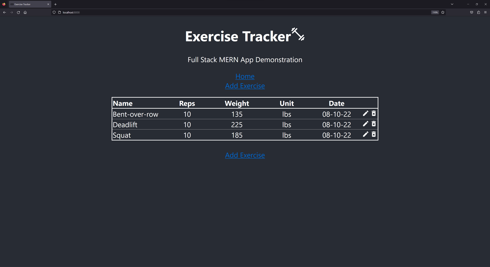
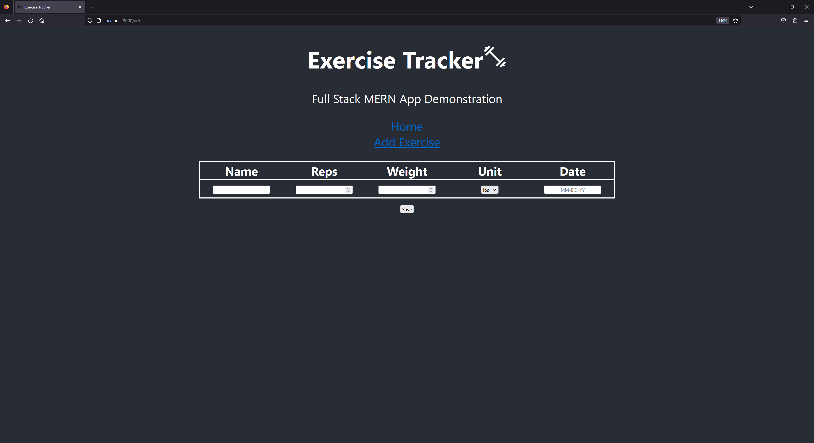
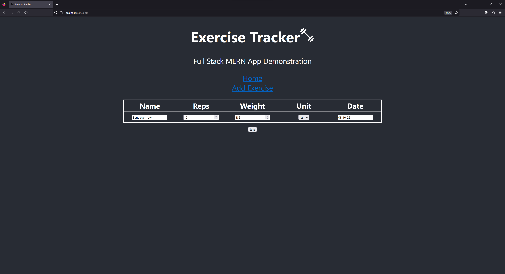

A MERN stack app for my web dev class.

Virtual exercise log that records the exercise name, repetitions, weight, units (lbs/kgs), and date. Permits editing or deletion of any exercise.

To use:
- provide a connection string to `MONGODB_CONNECT_STRING` in `/rest/.env`
- run `npm install` from `/rest`
- run `npm install` from `/react`
- run `npm start` from `/rest`
- run `npm start` from `/react`

Screenshots of the the fully functioning app:

